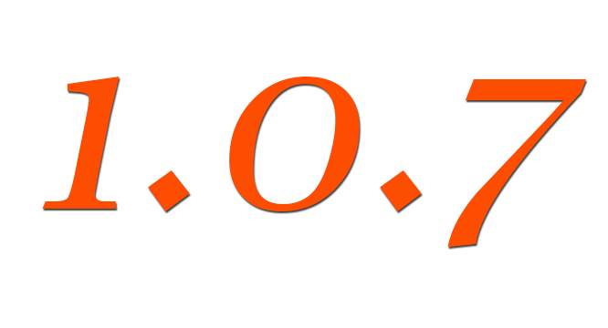
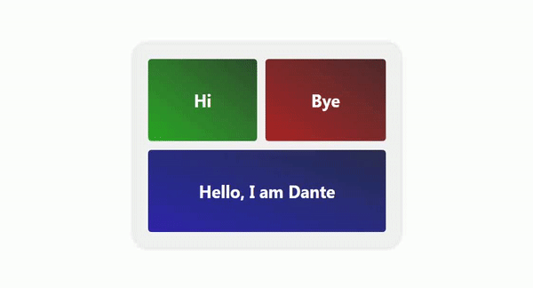

# Dantejsr
 

## npm

> npm i dantejsr

## cdn última versión @1.0.7 (Recomendada)

 

> 

Dantejsr es una biblioteca desarrollada en javascript, capaz de leer el código html y tomar todos los identificadores de componentes, ya sea el nombre de etiqueta, id o clase, creando con estos una función para cada uno, que puede recibir todas las propiedades que se deseen incluir; aunque, por defecto, la orientación del módulo se ha centrado en estilos rápidos, css apilables con bootstrap y eventos. El lema a seguir persigue el diseño funcional e interactivo.

Seguramente te preguntarás: ¿a qué me refiero? Al igual que en HTML, cada etiqueta es en sí misma un elemento separado, también en JavaScript, pero ahora con la posibilidad de invocar dinámicamente otros componentes a través de este módulo.

> Aquí la explicación de mi visión:

1. Diseño: la parte gráfica

2. Funcional: la parte lógica

3. Interactivo: flexibilidad

Entonces solo tendremos que pensar en algo, crear, diseñar y agregar eventos interconectados entre componentes HTML aislados, cada uno con sus propiedades.

Para diseñar puede usar propiedades de estilo, className, animación y eventos. Para la parte lógica y las funciones adicionales del diseño, los eventos en sí son la propiedad requerida. Desde aquí puede poner las propiedades que desee, por ejemplo, si es una < img >, src, o una etiqueta de link < a >, href, etc.

## Uso

Si descarga e instala Dantejsr usando npm, debe enrutar su index.html a la base de código del módulo.

Si usa cdn, simplemente necesita colocar la secuencia de comandos unpkg debajo de la estructura web general. Debe tener una raíz como clase o id, debe haber un div principal donde contenga toda su aplicación para poder usar este módulo, de lo contrario habrá conflicto.

Ejemplo:

 
	<body>
		

			
 Hola 

			
 Adiós 

			
 Hola, Soy Dante 

		

		

		
	</body>
	

Como puede ver, simplemente escriba la expresión Dan, seguida de un método con el nombre dado al componente (ya sea la etiqueta o el identificador), y dentro de él un objeto con las propiedades. Con Dantejsr puede invocar los nombres de otros componentes dentro de eventos de componentes ya definidos y asignar propiedades, animaciones, funciones y todo lo que desee. Sin embargo, en el ejemplo dado, solo ha podido ver cómo puede invocar un componente de otro y generar interactividad. Pero no olvides que podrás hacer cosas como esta:

<pre>
	Dan.box({
		className : "row bg-dark p-4",
		animate : {
			transition : [
				{
					transform : "scale(0.7)"
				},{
					transform : "scale(1)"
				}
			],
			config : { duration: 1000, iterations: 1}
		}
		click : () => alert("Hi world")
	})
</pre>

Como en el caso anterior, uso CSS importado pero no lo pongo aquí, sin embargo, puede apreciar cómo se apilan las propiedades.

Requiere conocer algunas reglas de uso para evitar errores:

1. Se puede invocar cualquier elemento html usando la expresión Dan
2. Puede usar cualquier propiedad de acuerdo con los estándares ya conocidos en HTML y Javascript, excepto en el caso de animaciones y eventos, al menos como la primera propiedad:

## Animaciones

Para realizar animaciones es obligatorio usar esta sintaxis dentro del objeto, lo único que se puede personalizar es la animación en sí, desde-hasta y la configuración (duración de la animación y número de repeticiones o iteraciones). En las iteraciones, puede usar "Infinito" si desea que la animación se repita infinitamente o definir un número específico de veces. Cualquier propiedad escrita en "desde" también debe escribirse en "hasta", de lo contrario habrá un error.

<pre>
	Dan.example({ //Format
		animate : {
			transition : [
				{/*desde*/},{/*hasta*/}
			],
			config : { duration: time, iterations: n}
		}
	})

	Dan.box({
		className : "row bg-dark text-light font-weight-bold p-4",
		animate : {
			transition : [
				{
					transform : "scale(0.7)"
				},{
					transform : "scale(1)"
				}
			],
			config : { duration: 1000, iterations: 1}
		},
		click : () => alert("Hi world")
	})
</pre>

## Eventos

Para eventos

<pre>
	Dan.example({ //Format
		eventName : () => {
			//instructions
		}
	})

	Dan.example({
		dblclick : () => {
			//instructions
		}
	})
</pre>

Puede escribir el nombre de cualquier evento como una key/llave directamente, y su valor será una función con las instrucciones. Dentro de esta función puede llamar a otros componentes, pero debe tener en cuenta algunos detalles:

Para llamar a cajas, solo casos como div, encabezado, sección, a un lado, pie de página, navegador, artículo, etc.

<pre>
	Dan.component1({
		eventName : () => {
			component2.style.background = "blue"
		}
	})
</pre>

Sin embargo, para llamar a componentes que no sean divs, header, section, aside, footer, nav, etc., debes asignarles una ID o atributo "name", esto solo sucede en estos casos. Sin embargo, no significa que no puedas llamarlos con Dan sin ningún problema.

	
Click here
 
	<button id="btn"> Click here </button>
	
<pre>
	Dan.box({
		click : () => btn.innerHTML = "Like"
	})

	Dan.btn({
		dblclick : ()=> alert("Hi world")
	})
</pre>

Por ahora, solo se admiten los siguientes eventos

1. click
2. dblclick
3. mousedown
4. mouseup
5. mouseenter
6. mouseleave
7. mousemove

-----------------------------------------------

> Desde un componente también puede llamar al contenedor por su nombre, después de todo, es un div.

Hay otro método que nos permite trabajar con nombres de clase repetidos, se llama Dan.common ({}), donde las claves del objeto que debe contener serán los nombres de clase comunes y sus valores las propiedades que se asignará a todos los elementos html con el mismo nombre de clase, incluidas las funciones lógicas, no solo el estilo.

	<button class="btn1"> btn 1 </button>
	<button class="btn2"> btn 2 </button>
	<button class="btn1"> btn 1 </button>
	<button class="btn2"> btn 2 </button>
	
<pre>
	Dan.common({
		btn1 : {
			className:"btn btn-dark m-2",
			click : () => alert("Hi world")
		},
		btn2 : {
			className:"btn btn-primary m-2",
			click : () => alert("Bye world")
		}
	})
</pre>

En este ejemplo, todas las propiedades asignadas a btn1 se aplicarán a cada elemento html (en este caso, botones) con el mismo identificador de clase. Lo mismo para btn2.

### NOTA: Primero debe invocar un componente con Dan para que luego pueda hacer referencia a él dentro de otro

## Webpack

Si usas webpack e importas un componente Dan, y dentro de ese componente deseas invocar el contenedor de la aplicación, debes hacerlo a través de "app", "app.property", "app.style.background", "app.addEventListener", etc.

## Versiones

- dantejsr@1.0.7 / Esta es la versión de mejor soporte hasta ahora, además es estable, no utilices versiones inferiores
- dantejsr@1.0.6
- dantejsr@1.0.5 
- dantejsr@1.0.4
- dantejsr@1.0.3
- dantejsr@1.0.2
- dantejsr@1.0.1
- dantejsr@1.0.0

## Conclusion

Usar Dantejsr puede ser una gran ventaja en múltiples formas, es fácil, dinámico, interactivo, flexible y tiene la posibilidad de extender Dan como un objeto. No tienes que preocuparte por el proceso de convertir elementos en variables, ni nada de eso, simplemente estarás ocupado desarrollando como un artista del frontend. El método common también es muy práctico porque puede asignar instrucciones lógicas a múltiples elementos con identificadores de clase compartidos. Lo único que requieres principalmente saber, es manejar objetos. Si amas los objetos esta librería es para tí.

Author: José Mavo, <jose.mavo.125@gmail.com>
