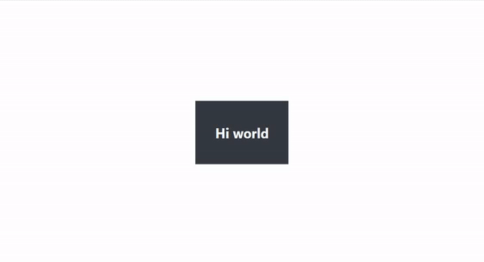
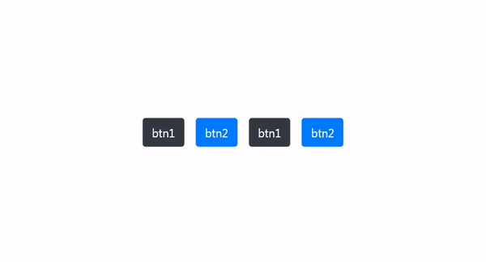

# Dantejsr
 

## npm

> npm i dantejsr

## cdn

> 

Dantejsr is a library developed in javascript, capable of reading the html code and taking all the component identifiers, be it the tag name, id or class, creating with these a function for each one, which can receive all the properties that are want to include; although by default the module orientation has been focused on quick styles, stackable css with bootstrap, and events. The motto to be followed pursues functional and interactive design.

Surely, you will ask yourself: What do I mean? As in HTML, each tag is itself a separate element, in javascript as well, but now with the possibility of invoking other components dynamically through this module.

> Here the explanation of my vision:

1. Design: the graphic Part

2. Functional: the logical Part

3. Interactive: flexibility

So only we will have to think about something, to create, to lay plans, to encourage, and to add events interconnected between components HTML isolated, each one with your properties.

To design you can use style properties, className, animate and events. For the logical part and additional functions to the design, the events themselves are the required property. From here you can put the properties you want, for example, if it is an image, src or one, href, etc.

## Use

If you download and install the npm intervening module, you must route its index.html to the dantejsr code base.

If you use cdn, you simply need to put the unpkg script below the general web structure. It must have a root as a class or id, there must be a main div where it contains all your application to be able to use this module, otherwise there will be conflict.

Example:

	<body>
		

			
 Hi 

			
 Bye 

			
 Hello, I am Dante 

		

		

		
	</body>
	

As you can see, just write the expression Dan, followed by a method with the name given to the component (be it the label or identifier), and within it an object with the properties. With Dantejsr you can invoke the names of other components within already defined component events, and assign properties, animations, functions and everything you want. However in the given example you have only been able to see how you can invoke one component from another and generate interactivity. But don't forget that you will be able to do something like this:

<pre>
	Dan.box({
		className : "row bg-dark p-4",
		animate : {
			transition : [
				{
					transform : "scale(0.7)"
				},{
					transform : "scale(1)"
				}
			],
			config : { duration: 1000, iterations: 1}
		}
		click : () => alert("Hi world")
	})
</pre>

As in the previous case, I use imported CSS but don't put it here, however you can customize how the properties are stacked.

It requires knowing some rules of use to avoid mistakes:

1. Any html element can be invoked using the expression Dan
2. You can use any property in accordance with the standards already known in HTML and Javascript, except in the case of animations and events, at least as the first property:

## Animations

To make animations it is mandatory to use this syntax inside the object, the only thing that can be customized is the animation itself, from-to, and the configuration (animation duration and number of repetitions or iterations). In iterations you can use "Infinity" if you want the animation to repeat infinitely, or define a specific number of times. Any property written in "from" must also be written in "to", otherwise there will be an error.

<pre>
	Dan.example({ //Format
		animate : {
			transition : [
				{/*from*/},{/*to*/}
			],
			config : { duration: time, iterations: n}
		}
	})

	Dan.box({
		className : "row bg-dark text-light font-weight-bold p-4",
		animate : {
			transition : [
				{
					transform : "scale(0.7)"
				},{
					transform : "scale(1)"
				}
			],
			config : { duration: 1000, iterations: 1}
		},
		click : () => alert("Hi world")
	})
</pre>

## Events

For events

<pre>
	Dan.example({ //Format
		eventName : () => {
			//instructions
		}
	})

	Dan.example({
		eventName : () => {
			//instructions
		}
	})
</pre>

You can write the name of any event as a key directly, and its value will be a function with the instructions. Within this function you can call other components, but you have to take into account some details:

To call boxes, only as long as they are boxes like div, header, section, aside, footer, browser, article, etc.

<pre>
	Dan.component1({
		eventName : () => {
			component2.style.background = "blue"
		}
	})
</pre>

To call components like buttons or the like, however, you need to assign them an ID, this only happens in these cases. It doesn't mean you can't call them using Dan though, without any problem.

	
Click here
 
	<button id="btn"> Click here </button>
	
<pre>
	Dan.box({
		click : () => btn.innerHTML = "Like"
	})

	Dan.btn({
		dblclick : ()=> alert("Hi world")
	})
</pre>

For now, only the following events are supported

click
dblclick
mousedown
mouseup
mouseenter
mouseleave
mouse movement

-----------------------------------------------

> From a component you can also call the container by its name, after all it is a box.

There is another method that allows us to work with repeated class names, it is called Dan.common ({}), where the keys of the object that it must contain, will be the common class names, and their values ​​the properties that will be assigned to all the elements html with the same class name, including logical functions, not just style.

	<button class="btn1"> btn 1 </button>
	<button class="btn2"> btn 2 </button>
	<button class="btn1"> btn 1 </button>
	<button class="btn2"> btn 2 </button>
	
<pre>
	Dan.common({
		btn1 : {
			className:"btn btn-dark m-2",
			click : () => alert("Hi world")
		},
		btn2 : {
			className:"btn btn-primary m-2",
			click : () => alert("Bye world")
		}
	})
</pre>

In this example, all the properties assigned to btn1 will be applied to each html element (in this case, buttons) with the same class identifier. The same for btn2.

Using Dantejsr can be a great advantage in multiple ways,
it is easy, dynamic, interactive, flexible and has the possibility to extend Dan as an object. You don't have to worry about the process of converting elements to variables, or anything like that, you'll just be busy developing like a frontend artist. The common method is also very practical because you can assign logical instructions to multiple elements with shared class identifiers.

Author: José Mavo, <jose.mavo.125@gmail.com>
